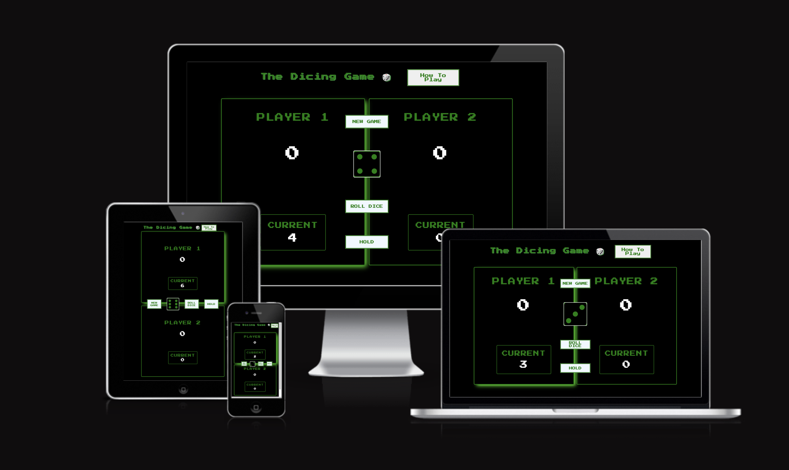

# The Dicing Game 🎲 #

The live link can be found here: 
[Visit Webpage](https://tamassomi.github.io/the-dicing-game/)

This game is a dicing game using vanilla javaScript deployed for learning purposes.

Player1 will start the game. To start, press "Dice". The goal is to collect 100 points first. After every dice, you will collect your points in the current section. If you dice one, you will lose the current points and the other player comes. But if you hold your points before you dice one, you will get your points to the total from currents. Who collects 100 total points first, wins the game!

## User Stories ##

* As a visiting user the purpose is to play an exiting game that depends mainly on luck but you can determine how much you want to risk.
* As a visiting user i would like to play a game that runs in the browser.
* As a visiting user i expect the game to be fully responsive so i can play on any device.
* As a visiting user i would like to play a game that possible to play with a nother person.
* As a visiting user i would like to read the rules/how to play.

## Target Audiance ##

* People whom interested in online games that they can play with a friend.
* People whom interested in games that depens on luck but you deside how much to risk.

## Site Owner ##

* As site owner, i want a nice but simle, retro designed game.
* As site owner, i want the site to be responsive so the target audiance much wider, because the user can play on any device.
* As site owner, i want the game to be easy to use and have a how to play section, so all the user can find out the rules.

## Features ##

* The site is responsive and user can play on any device.

* There is a how to play section so that anyone can see the rules. Which can be open easily by clicking on the "How To Play" button.

* User can start a new game any time by clicking on the New Game button.

* User can change the player name by clicking on the name that needs to be changed.
* The game accepts between 3-8 charackters, if not valid name is inserted than it is indicated.

* If one player reaches 100 points, the winner is displayed. The players aren't able to roll the dice, or hold points anymore, untill new game started by clicking the new game button. 

## Future features and improvements ##

* User could set the maximum points to achive to win the game.
* One player mode, against the computer.
* Save a highscore based on, within how many rounds the player winns or maybe a timer.

## Planning ## 

* I created a chart for the game logic to make it easier to see, what functions will i need for all the functionalities.

* Wireframe for desktop and tablet screens:

* Wireframe fore mobile screens:

## Bugs ##

* On mobile sceens the navigation is overlaying the half of the usernames, so when user clicks on the name to change it, the new game button is cliked.

Solution: I gave a width of fit-content for the navigation.

## Testing ##

* When i first open the page, all the scores are set to 0.
* The current player displayed by the green shadow for the players side.

* By clicking on Player 1 or Player 2 the modal pops up for taking the new player name.

* When i insert a new player name, it's displayed correctly.

* By hovering over the How To Play button the transition happens as expected. (The colors are changing)(The cursor was removed by the computer, when the screenshot was made.)

* If i click the button the modal opens, i can read the description and by clicking on the close rules button, the modal closes.

* When i click on the roll dice button i get the dice image. The correct points added to the current section.

* When i click on hold, my current points get to the overall points. The currents points set back to 0 and the player change indicated by the green shadow. 

* After a few roll, i rolled one. The current points were lost and the current player was swapped as expected.

* When i first reach 100 overall points, the winner is displayed and the roll dice and hold buttons don't work anymore as expected.

* I click on the new game button and the game reset to the initial state as expected.

## Validation ##

* The Css code passes the W3css validator with no error.

* The Html code passes the nu Html Checker with no error.

* The javaScript code passes the jsHint checker with no error.

* Lighthouse test:

## Deployment ##

This website was published using GitHub Pages, by following these steps:

1. Log in to GitHub.
2. Select the repository of the project.
3. Click on the setting button in the navigation bar.
4. On the left side under the Code and Automation title click on the Pages button.
5. In the Build and Deployment section you'll nedd to select in Source dropdown menu: Deploy from Branch. And in Branch dropdown menu: main and then root and click on Save button.
6. After a few minutes the link will appear on the top of that page.

Follow the next steps to open the project on GitPod:

1. Log in to GitHub.
2. Select the [repository](https://github.com/TamasSomi/the-dicing-game) of the project.
3. Click on GitPod button.
4. Click on New Workspace.

## Technology ##

Used technologies during development:

* HTML
* CSS
* JavaScript
* GitPod
* GitHub

## Credits ## 

* Images for the dices: [flaticon](https://www.flaticon.com/)

* I used for the retro style 'Press Start 2P' and sans-serif for fall back fonts from: [Google Fonts](https://fonts.google.com/?query=press+start+2p)

* The Love Maths project by Code Institute helped me a lot.

* The idea for the game comes from a course on [Udemy](https://www.udemy.com/) from Jonas  Schmedtmann [The Complete JavaScript Course](https://www.udemy.com/course/the-complete-javascript-course/) 